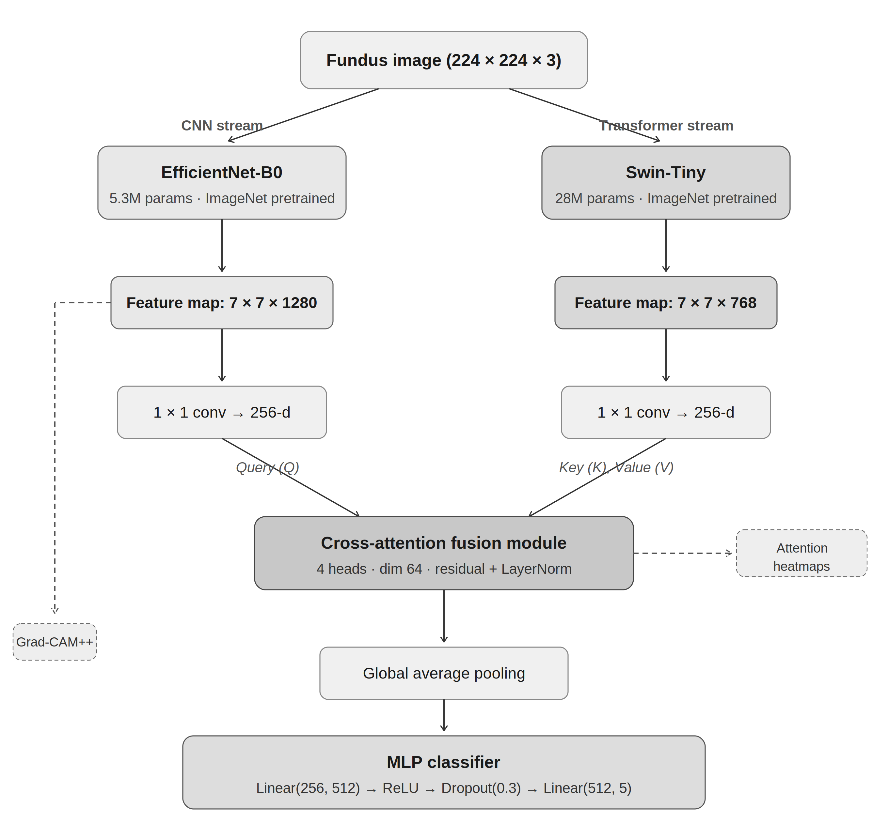

# LHCTNet: Lightweight Hybrid CNN-Transformer Network for Diabetic Retinopathy Grading

My implementation of **LHCTNet**, a dual-stream architecture combining EfficientNet-B0 and Swin Transformer with a cross-attention fusion module for five-class diabetic retinopathy grading from fundus images.

> **Early Detection of Diabetic Retinopathy Using Deep Learning on Fundus Images**
> Muhammad Zeerak — MSc Dissertation, 2026

---

## Architecture

<p align="center">
  
</p>

LHCTNet processes fundus images through two parallel streams:

- **CNN stream** — EfficientNet-B0 (5.3M params, ImageNet pretrained) extracts local spatial features (7 × 7 × 1280)
- **Transformer stream** — Swin-Tiny (28M params, ImageNet pretrained) captures global context (7 × 7 × 768)

Both feature maps are projected to a shared 256-d embedding space via 1×1 convolutions, then fused through a **4-head cross-attention module** where CNN features serve as queries and Transformer features as keys/values. The attention weights provide inherent spatial explainability. Grad-CAM++ is applied to the CNN stream as a complementary explanation mechanism.

---

## Key Results

### Five-Class ICDR Grading (APTOS 2019 Test Set)

| Model | QWK | Accuracy | Macro AUC | Macro F1 |
|---|---|---|---|---|
| EfficientNet-B0 Only | 0.808 | 69.5% | 0.851 | 0.523 |
| Swin-Tiny Only | **0.876** | **75.6%** | **0.894** | **0.608** |
| LHCTNet-Concat | 0.849 | 73.3% | 0.884 | 0.577 |
| LHCTNet Full | 0.847 | 73.3% | 0.878 | 0.585 |

### Binary Referable Screening (Grade ≥ 2)

| Model | Sensitivity | Specificity | AUC |
|---|---|---|---|
| EfficientNet-B0 Only | 87.63% | 78.68% | 0.935 |
| Swin-Tiny Only | 84.75% | 88.01% | 0.938 |
| LHCTNet-Concat | 86.94% | 83.46% | 0.944 |
| LHCTNet Full | **89.69%** | 82.35% | **0.965** |

### Computational Efficiency

| Model | Params (M) | CPU Inference (ms) |
|---|---|---|
| EfficientNet-B0 Only | 4.67 | 27.3 |
| Swin-Tiny Only | 27.91 | 78.3 |
| LHCTNet-Concat | 34.03 | 112.8 |
| LHCTNet Full | 32.45 | 110.4 |

All variants achieve sub-200ms CPU inference latency.

---

## Datasets

| Dataset | Role | Images | Classes |
|---|---|---|---|
| [APTOS 2019](https://www.kaggle.com/c/aptos2019-blindness-detection) | Train / Val / Test (70/15/15) | 3,662 | 5 (ICDR 0–4) |
| [IDRiD](https://ieee-dataport.org/open-access/indian-diabetic-retinopathy-image-dataset-idrid) | External validation (held-out) | 516 | 5 |
| [EyePACS](https://www.kaggle.com/c/diabetic-retinopathy-detection) | External validation (held-out, 3K subset) | 3,000 | 5 |

IDRiD and EyePACS are **completely held out** — never seen during training or hyperparameter selection.

> **Note:** This repository includes only 2 sample images per folder for structure reference. You must download the full datasets from their respective sources and place the images in the corresponding directories:
>
> After downloading, place the fundus images into the relevant folders. The preprocessing pipeline (Section [Preprocessing](#preprocessing)) expects raw `.png` or `.jpg` images in these directories.

---

## Installation

```bash
git clone https://github.com/Muhammad-Zeerak/LHCTNetProjectCode.git
cd LHCTNetProjectCode
pip install -r requirements.txt
```

### Dependencies

- Python ≥ 3.10
- PyTorch ≥ 2.1.0
- torchvision
- timm ≥ 1.0
- numpy
- pandas
- scikit-learn
- matplotlib
- opencv-python (for CLAHE preprocessing)
- grad-cam (for Grad-CAM++ visualisations)

---

## Preprocessing

All fundus images undergo the following pipeline before training and inference:

1. **CLAHE** on the green channel (clip limit = 2.0, tile grid = 8 × 8)
2. **Resize** to 224 × 224 using bilinear interpolation
3. **Normalise** with ImageNet channel means and standard deviations

Training augmentations (training set only):
- Random horizontal flip (p = 0.5)
- Random vertical flip (p = 0.5)
- Random rotation (±15°)
- Random brightness/contrast jitter (factor = 0.2)

---

## Full Piepline Run

```bash
python run_all.py
```

### Training Configuration

| Parameter | Value |
|---|---|
| Optimiser | AdamW (β1=0.9, β2=0.999) |
| Base learning rate | 1e-4 |
| Backbone learning rate | 1e-5 (differential) |
| Weight decay | 1e-2 |
| Batch size | 32 |
| Max epochs | 25 |
| Early stopping patience | 5 (monitors val QWK) |
| LR schedule | 2-epoch linear warmup → cosine annealing (min 1e-6) |
| Loss | Cross-entropy + label smoothing (0.1) + class weights |
| Gradient clipping | Max norm 1.0 |
| Precision | Mixed precision (FP16) via `torch.amp` |
| Seed | 42 |

A **differential learning rate** is applied: pretrained backbones fine-tune at 1/10th the base rate (1e-5) whilst the fusion module and classifier train at the full rate (1e-4).

---

## Citation

If you use this code or find this work useful, please cite:

```bibtex
@mastersthesis{zeerak2025lhctnet,
  title={Early Detection of Diabetic Retinopathy Using Deep Learning on Fundus Images},
  author={Zeerak, Muhammad},
  year={2026},
  school={[University of East London]},
  type={MSc Dissertation}
}
```

---

## Acknowledgements

- [APTOS 2019 Blindness Detection](https://www.kaggle.com/c/aptos2019-blindness-detection) dataset
- [IDRiD](https://ieee-dataport.org/open-access/indian-diabetic-retinopathy-image-dataset-idrid) dataset
- [EyePACS](https://www.kaggle.com/c/diabetic-retinopathy-detection) dataset
- [EfficientNet](https://arxiv.org/abs/1905.11946) (Tan and Le, 2019)
- [Swin Transformer](https://arxiv.org/abs/2103.14030) (Liu et al., 2021)
- [timm](https://github.com/huggingface/pytorch-image-models) library

---

## Disclaimer

This model is a research prototype and is **not intended for direct clinical deployment**. Any use in a clinical setting would require further validation, regulatory approval (e.g. MHRA Software as a Medical Device framework), and integration with existing screening infrastructure.